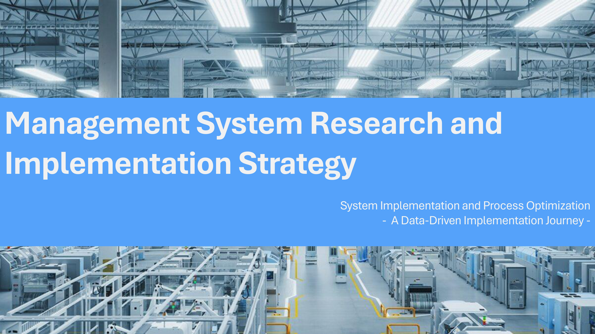
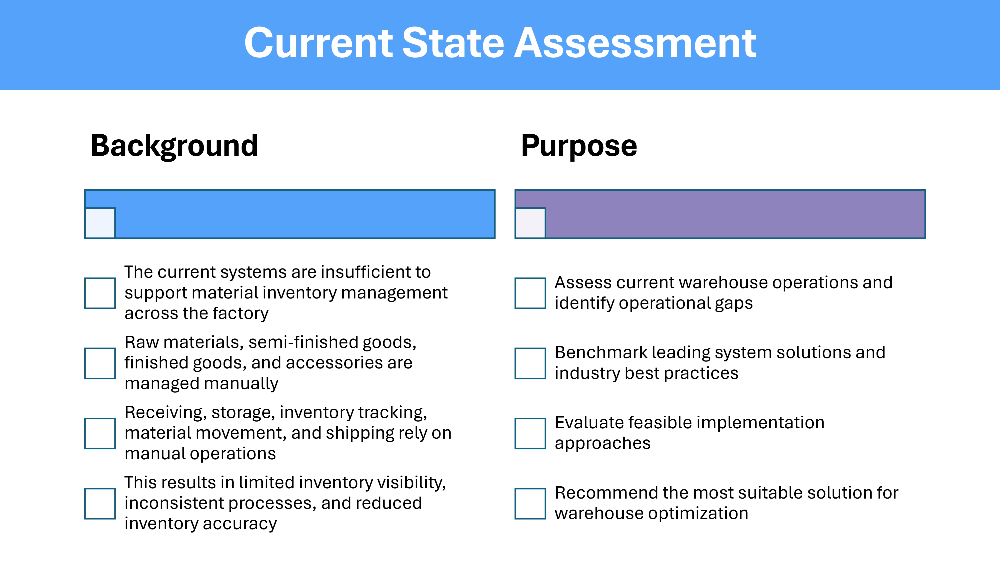
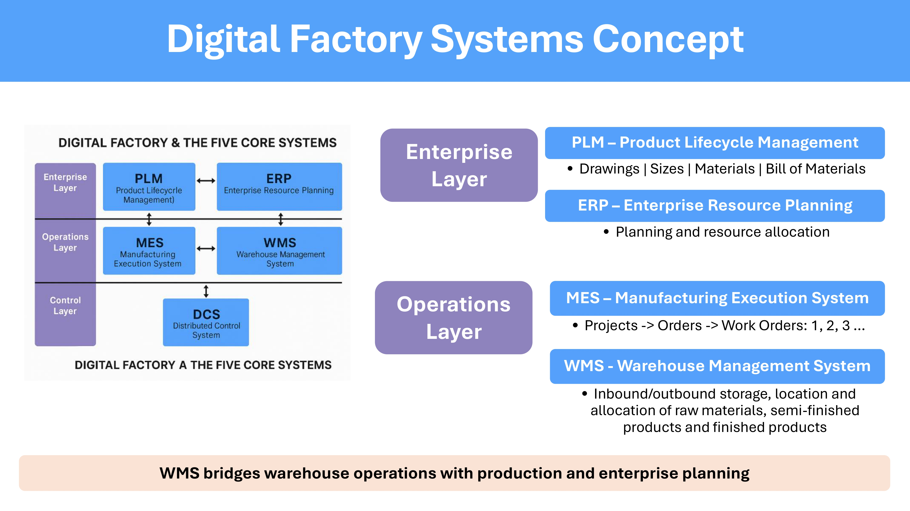
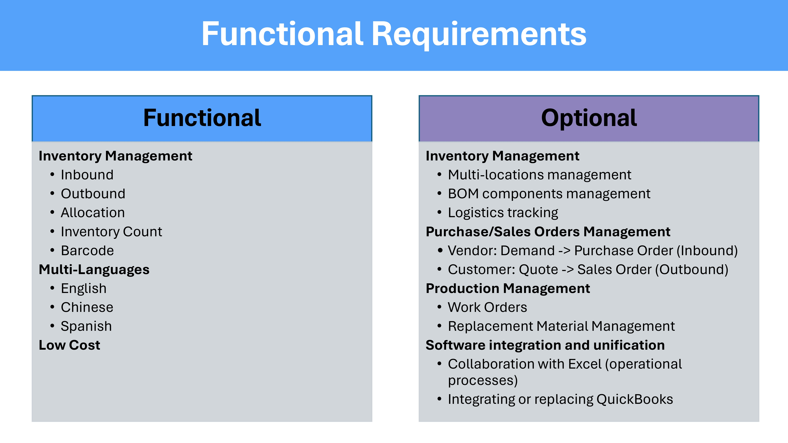
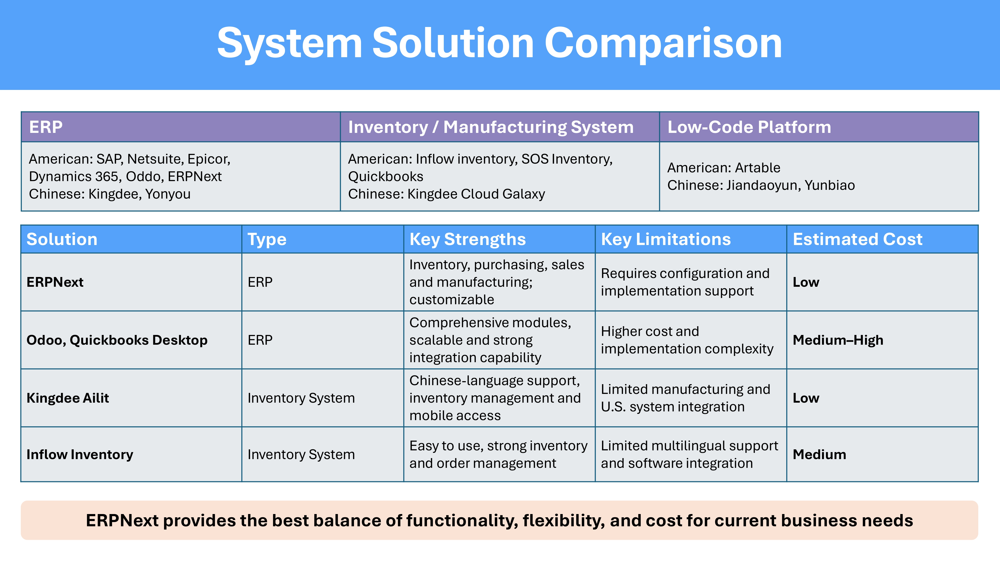
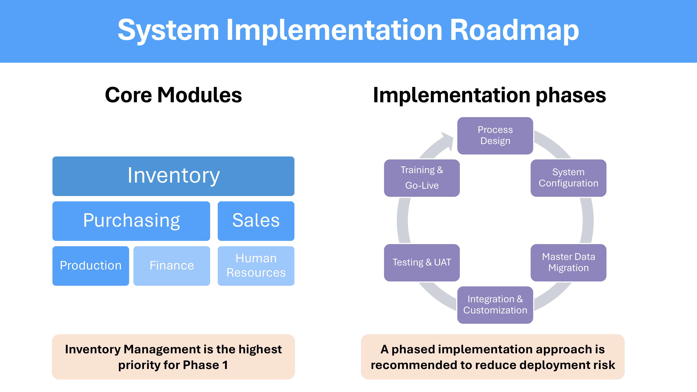
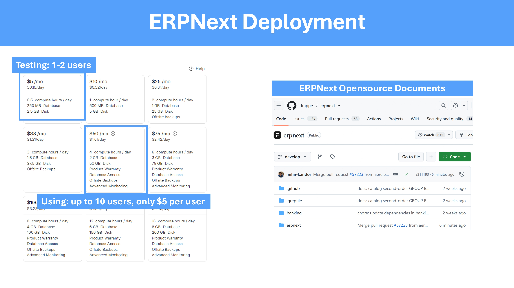
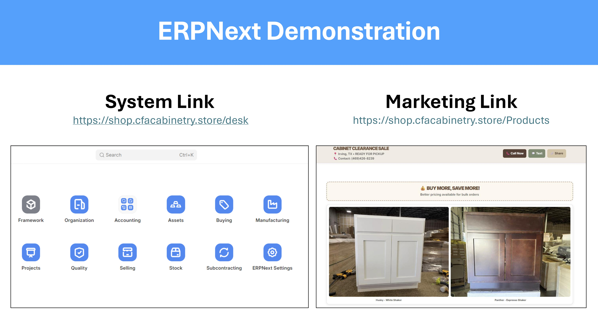

# Manufacturing Management System Research

A research project on enterprise management systems for a manufacturing company, focusing on warehouse management, ERP evaluation, implementation planning, and digital transformation.

---

## 📌 Project Overview

This project was conducted to evaluate and recommend an appropriate management system for a cabinet manufacturing company.

The research covers:

- Current warehouse operation assessment
- Digital factory system architecture
- Functional requirements analysis
- ERP / WMS solution comparison
- Implementation roadmap
- ERPNext proof of concept

The objective is to improve inventory visibility, standardize business processes, and support future digital transformation.

---

## 📑 Presentation Contents

| Section | Description |
|---------|-------------|
| Current State Assessment | Analyze existing warehouse operations and business challenges |
| Digital Factory Systems Concept | Introduce the relationship between PLM, ERP, MES, and WMS |
| Functional Requirements | Define required business functions for the management system |
| System Solution Comparison | Compare ERPNext, Odoo, Inflow Inventory, and Kingdee |
| Implementation Roadmap | Present a phased implementation strategy |
| ERPNext Demonstration | Demonstrate the selected solution |

---

## 📷 Project Preview

### Front Page

### Current State Assessment

### Digital Factory Systems Concept

### Functional Requirements

### System Solution Comparison

### System Implementation Roadmap

### ERPNext Deployment

### ERPNext Demonstration

---

---

## 🌐 Online Demonstration

An online ERPNext instance was deployed to demonstrate the proposed management system.

| Resource | Link |
|----------|------|
| ERPNext System | https://shop.cfacabinetry.store/desk |
| Product Website | https://shop.cfacabinetry.store/Products |

## 🔍 Technologies & Topics

- ERP Evaluation
- Warehouse Management System (WMS)
- Inventory Management
- Manufacturing Process Analysis
- Business Process Optimization
- Digital Transformation
- ERPNext
- Odoo
- Inflow Inventory
- Kingdee

---

## 🎯 Key Outcome

After evaluating multiple enterprise management systems, **ERPNext** was identified as the most suitable solution for the current business requirements based on functionality, flexibility, implementation feasibility, and cost effectiveness.

The proposed implementation follows a phased deployment strategy to minimize risk and support future business growth.

---

## 📄 Documents

- Manufacturing Management System Research.pptx
- Presentation screenshots
- README documentation

---

## 👤 Author

**Wenting Luo**

If you have any questions, suggestions, or just want to say hello, you can reach out to [Wenting Luo](mailto:wentingluo91@gmail.com). I would love to hear from you!

